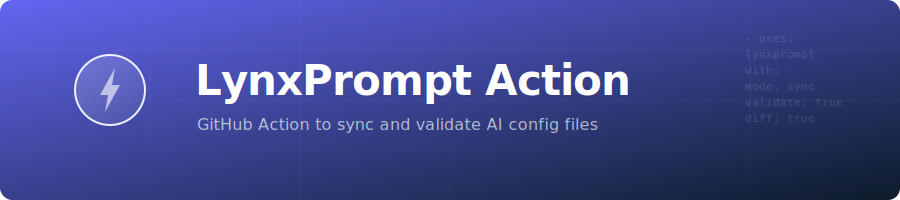

<p align="center">
  
</p>

[](https://github.com/GeiserX/lynxprompt-action/actions/workflows/ci.yml)
[](https://codecov.io/gh/GeiserX/lynxprompt-action)

# LynxPrompt Action

A GitHub Action to sync, validate, generate, and diff AI IDE configuration files with [LynxPrompt](https://lynxprompt.com) -- a self-hostable platform for managing AI coding tool configs across 30+ tools.

Supported config files include `AGENTS.md`, `CLAUDE.md`, `.cursor/rules/`, `.github/copilot-instructions.md`, `.windsurfrules`, `AIDER.md`, and more.

## Features

| Mode | Description | Trigger |
|------|-------------|---------|
| **sync** | Upload local AI config files as blueprints to LynxPrompt | Push to main |
| **validate** | Check that AI config files are present and well-formed | Pull request |
| **generate** | Pull blueprints from LynxPrompt and write them to the repo | Schedule / manual |
| **diff** | Compare local configs with cloud blueprints and report drift | Pull request |

## Quick Start

### 1. Get a LynxPrompt API Token

Sign in to your LynxPrompt instance and create an API token (format: `lp_<64_hex_chars>`). Add it as a repository secret named `LYNXPROMPT_TOKEN`.

### 2. Add to Your Workflow

```yaml
- uses: GeiserX/lynxprompt-action@v1
  with:
    mode: sync
    token: ${{ secrets.LYNXPROMPT_TOKEN }}
```

## Usage Examples

### Sync Configs to LynxPrompt on Push

Upload all AI configuration files as blueprints whenever you push to the default branch.

```yaml
name: Sync AI Configs
on:
  push:
    branches: [main]
    paths:
      - 'AGENTS.md'
      - 'CLAUDE.md'
      - '.cursor/rules/**'
      - '.github/copilot-instructions.md'
      - '.windsurfrules'
      - 'AIDER.md'

jobs:
  sync:
    runs-on: ubuntu-latest
    steps:
      - uses: actions/checkout@v4

      - uses: GeiserX/lynxprompt-action@v1
        with:
          mode: sync
          token: ${{ secrets.LYNXPROMPT_TOKEN }}
          visibility: PRIVATE
```

### Validate Configs on Pull Request

Check that AI config files are present and well-formed on every PR. Require specific platforms to be configured.

```yaml
name: Validate AI Configs
on:
  pull_request:
    branches: [main]

jobs:
  validate:
    runs-on: ubuntu-latest
    permissions:
      pull-requests: write
    steps:
      - uses: actions/checkout@v4

      - uses: GeiserX/lynxprompt-action@v1
        with:
          mode: validate
          token: ${{ secrets.LYNXPROMPT_TOKEN }}
          platforms: 'cursor,claude-code,copilot'
```

### Generate Configs from LynxPrompt on Schedule

Pull blueprints from LynxPrompt and write them to the repo on a daily schedule. Auto-commit the changes.

```yaml
name: Generate AI Configs
on:
  schedule:
    - cron: '0 6 * * 1'  # Every Monday at 06:00 UTC
  workflow_dispatch:

jobs:
  generate:
    runs-on: ubuntu-latest
    permissions:
      contents: write
    steps:
      - uses: actions/checkout@v4

      - uses: GeiserX/lynxprompt-action@v1
        with:
          mode: generate
          token: ${{ secrets.LYNXPROMPT_TOKEN }}
          commit-changes: 'true'
```

### Diff Configs on Pull Request

Compare local configs with cloud blueprints and post a drift report as a PR comment. Optionally fail the check if drift is detected.

```yaml
name: Diff AI Configs
on:
  pull_request:
    branches: [main]

jobs:
  diff:
    runs-on: ubuntu-latest
    permissions:
      pull-requests: write
    steps:
      - uses: actions/checkout@v4

      - uses: GeiserX/lynxprompt-action@v1
        with:
          mode: diff
          token: ${{ secrets.LYNXPROMPT_TOKEN }}
          fail-on-drift: 'true'
        env:
          GITHUB_TOKEN: ${{ secrets.GITHUB_TOKEN }}
```

### Monorepo Support

The action automatically detects nested config files. For example, in a monorepo:

```
my-monorepo/
  AGENTS.md                          # Root-level config
  packages/
    api/
      AGENTS.md                      # Package-specific config
    web/
      AGENTS.md
      .cursor/rules/frontend.mdc
```

Each file is synced as a separate blueprint with its full relative path as the name (e.g., `packages/api/AGENTS.md`).

### Custom File Patterns

Override the default glob patterns to include or limit which files are processed:

```yaml
- uses: GeiserX/lynxprompt-action@v1
  with:
    mode: sync
    token: ${{ secrets.LYNXPROMPT_TOKEN }}
    files: |
      CLAUDE.md
      docs/AGENTS.md
      .cursor/rules/**/*.mdc
```

## Inputs

| Input | Description | Required | Default |
|-------|-------------|----------|---------|
| `mode` | Action mode: `sync`, `validate`, `generate`, or `diff` | Yes | - |
| `token` | LynxPrompt API token (`lp_...`) | Yes | - |
| `api-url` | LynxPrompt API base URL | No | `https://lynxprompt.com` |
| `files` | Glob pattern(s) for config files (comma or newline separated) | No | See below |
| `visibility` | Blueprint visibility when syncing: `PRIVATE`, `TEAM`, or `PUBLIC` | No | `PRIVATE` |
| `platforms` | Required platforms for validate mode (comma-separated) | No | - |
| `fail-on-drift` | Fail the check if drift is detected (diff mode) | No | `false` |
| `commit-changes` | Auto-commit generated files (generate mode) | No | `false` |

**Default file patterns:**
```
**/{AGENTS,CLAUDE,AIDER}.md
**/.github/copilot-instructions.md
**/.windsurfrules
**/.cursor/rules/**/*.mdc
```

## Outputs

| Output | Description | Mode |
|--------|-------------|------|
| `synced-count` | Number of blueprints created or updated | sync |
| `validation-passed` | Whether all validations passed (`true`/`false`) | validate |
| `generated-count` | Number of files generated or updated | generate |
| `drift-detected` | Whether any drift was detected (`true`/`false`) | diff |

## Supported Platforms

The action recognizes configuration files for these AI coding tools:

| Platform | Config File(s) | Blueprint Type |
|----------|----------------|----------------|
| Claude Code | `CLAUDE.md`, `AGENTS.md` | `CLAUDE_MD`, `AGENTS_MD` |
| Cursor | `.cursor/rules/*.mdc` | `CURSOR_RULES` |
| GitHub Copilot | `.github/copilot-instructions.md` | `COPILOT_INSTRUCTIONS` |
| Windsurf | `.windsurfrules` | `WINDSURF_RULES` |
| Aider | `AIDER.md` | `AIDER_MD` |

## Permissions

Depending on the mode, your workflow may need specific permissions:

```yaml
permissions:
  contents: write        # Required for generate mode with commit-changes
  pull-requests: write   # Required for validate/diff modes to post PR comments
```

For PR comment posting, also pass `GITHUB_TOKEN` as an environment variable:

```yaml
env:
  GITHUB_TOKEN: ${{ secrets.GITHUB_TOKEN }}
```

## Self-Hosted LynxPrompt

If you self-host LynxPrompt, point the action to your instance:

```yaml
- uses: GeiserX/lynxprompt-action@v1
  with:
    mode: sync
    token: ${{ secrets.LYNXPROMPT_TOKEN }}
    api-url: 'https://lynxprompt.internal.example.com'
```

## Development

```bash
# Install dependencies
npm install

# Type-check
npm run typecheck

# Build (compile TypeScript and bundle with ncc)
npm run build
```

The compiled bundle is output to `dist/index.js`. This file must be committed to the repository for the action to work.

## License

GPL-3.0
