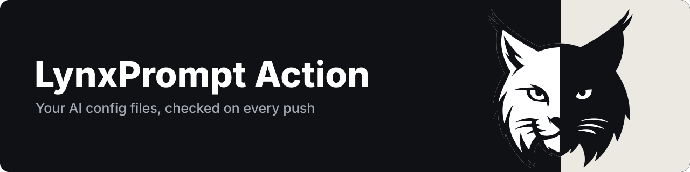

<p align="center">
  
</p>

[](https://github.com/GeiserX/lynxprompt-action/releases)
[](https://github.com/GeiserX/lynxprompt-action/actions/workflows/ci.yml)
[](LICENSE)
[](https://codecov.io/gh/GeiserX/lynxprompt-action)

# LynxPrompt Action

A GitHub Action to sync, validate, generate, and diff AI IDE configuration files with [LynxPrompt](https://lynxprompt.com) -- a self-hostable platform for managing AI coding tool configs across 30+ tools.

Supported config files include `AGENTS.md`, `CLAUDE.md`, `.cursor/rules/`, `.github/copilot-instructions.md`, `.windsurfrules`, `AIDER.md`, and more.

## Features

- **sync**: upload local AI config files as blueprints to LynxPrompt, e.g. on push to main.
- **validate**: check that AI config files are present and well-formed, and require chosen platforms, on pull requests.
- **generate**: pull blueprints from LynxPrompt and write them to the repo, optionally committing them, on a schedule.
- **diff**: compare local configs with cloud blueprints and post a drift report on the PR, optionally failing the check.
- Finds nested config files in monorepos and names each blueprint by its relative path.
- Custom glob patterns through the `files` input.
- Works with lynxprompt.com or a self-hosted instance through `api-url`.

## Quick start

Create an API token in LynxPrompt (format: `lp_<64_hex_chars>`), save it as the repository secret `LYNXPROMPT_TOKEN`, and add:

```yaml
- uses: GeiserX/lynxprompt-action@v1
  with:
    mode: sync
    token: ${{ secrets.LYNXPROMPT_TOKEN }}
```

## Documentation

- [Usage](docs/usage.md): a full workflow per mode, monorepos, custom file patterns, permissions, self-hosted LynxPrompt
- [Reference](docs/reference.md): inputs, default file patterns, outputs, supported platforms
- [Development](docs/development.md): building the bundle in `dist/index.js`

## Related projects

[LynxPrompt](https://github.com/GeiserX/LynxPrompt), [lynxprompt-vscode](https://github.com/GeiserX/lynxprompt-vscode), [lynxprompt-mcp](https://github.com/GeiserX/lynxprompt-mcp), [n8n-nodes-lynxprompt](https://github.com/GeiserX/n8n-nodes-lynxprompt), [homebrew-lynxprompt](https://github.com/GeiserX/homebrew-lynxprompt).

## License

[GPL-3.0](LICENSE)
